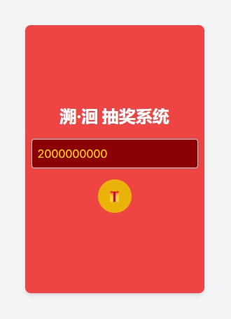
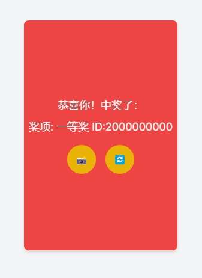
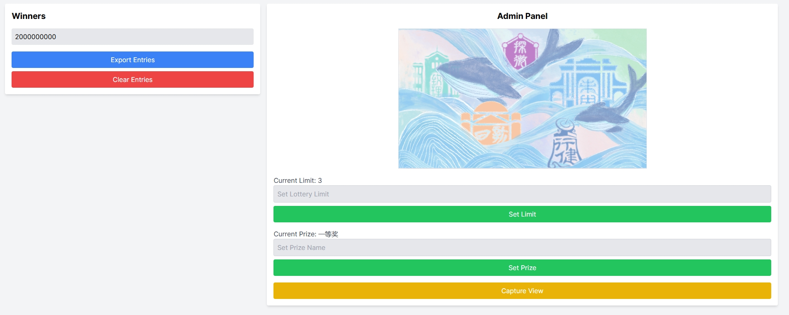

# Lottery App

这是一个基于Next.js构建的抽奖系统，部署在Vercel上。用户可以通过不同设备访问网页输入自己的ID进行抽奖，管理员可以通过后台管理抽奖的状态、设置抽奖上限和奖品名称等。

## 项目地址

[https://lottery-app-lime.vercel.app/](https://lottery-app-lime.vercel.app/)

## 功能

### 用户界面

- 输入ID参加抽奖
- 提交时进行ID格式验证
- 实时显示抽奖结果
- 支持动画效果

### 管理员界面

- 显示所有中奖ID
- 提供一键导出和删除功能
- 设置抽奖上限和奖品名称
- 显示当前抽奖上限和奖品名称
- 提供截图功能

## 技术栈

- Next.js
- Tailwind CSS
- framer-motion
- html2canvas
- Vercel KV（数据库）

## 文件结构

```
app
- admin
  - page.js
- api
  - entries
    - route.js
  - limit
    - route.js
  - prize
    - route.js
- page.js

lib
- kv.js

.env.local
```

## 环境变量

在 `.env.local` 文件中配置以下环境变量：

```
KV_REST_API_URL=your_vercel_kv_rest_api_url
KV_REST_API_TOKEN=your_vercel_kv_rest_api_token
```

## 安装和运行

### 安装依赖

```bash
npm install
```

### 运行开发服务器

```bash
npm run dev
```

### 部署到Vercel

1. 将代码推送到你的Git仓库
2. 登录Vercel并新建项目，选择你的Git仓库
3. 设置环境变量并部署

## 使用说明

### 用户界面

1. 打开[抽奖页面](https://lottery-app-lime.vercel.app/)
2. 输入ID（格式为20XXXXXXXX，其中XX是0-9的数字）
3. 点击“提交”按钮参与抽奖





### 管理员界面

1. 打开[管理员页面](https://lottery-app-lime.vercel.app/admin)
2. 查看当前所有中奖ID
3. 设置抽奖上限和奖品名称
4. 使用一键导出、一键删除和截图功能管理抽奖活动

