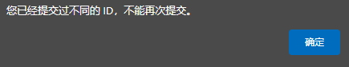
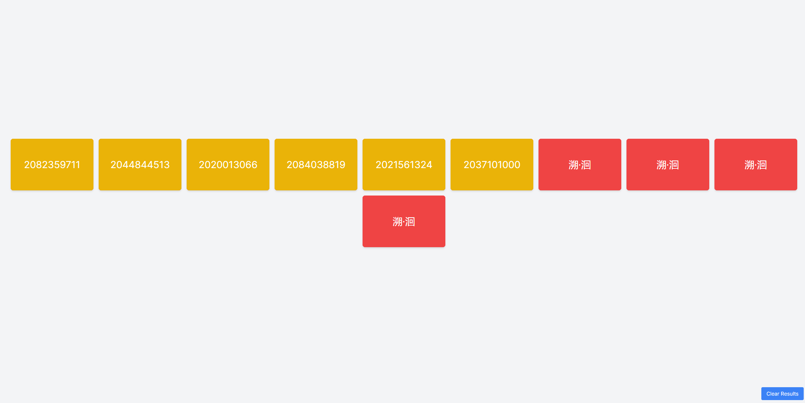
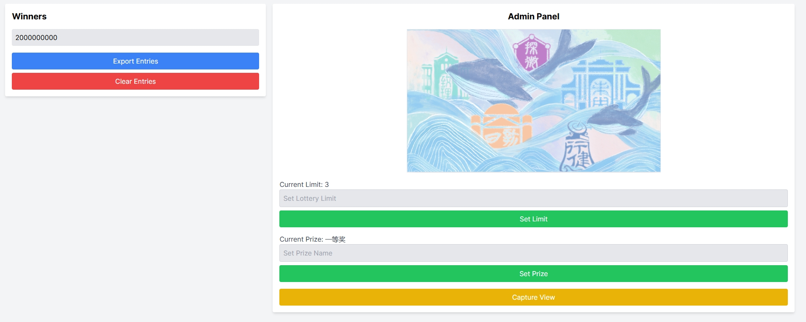
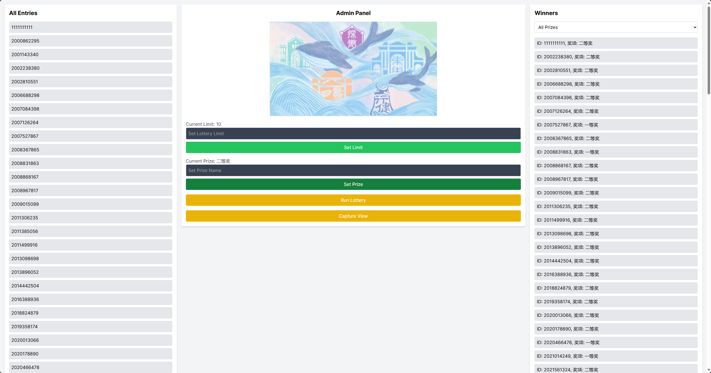

# Lottery App

这是一个基于 Next.js 构建的抽奖系统，部署在本地环境中，利用的是本地数据库。用户可以通过不同设备访问网页输入自己的 ID 进行抽奖，管理员可以通过后台管理抽奖的状态、设置抽奖上限和奖品名称等。

## 功能

### 用户界面

- 输入 ID 参加抽奖
- 提交时进行 ID 格式验证
- 实时显示抽奖结果
- 支持动画效果
- 抽奖卡片从左侧进入，然后依次翻转显示内容
- 每个设备只能输入一个 ID 进行查询（允许重复提交相同的 ID）

### 抽奖界面

- 点击抽奖按钮进行一次抽奖
- 将本次抽奖的所有结果用动画方式呈现，卡片从左边进入，依次翻开

### 管理员界面

- 显示所有中奖 ID
- 按照奖项名称分类查看中奖结果
- 提供一键导出和删除功能
- 设置抽奖上限和奖品名称
- 显示当前抽奖上限和奖品名称
- 提供截图功能

## 技术栈

- Next.js
- Tailwind CSS
- framer-motion
- html2canvas
- 本地数据库

## 文件结构

```
app
- admin
  - page.js
- api
  - entries
    - route.js
  - limit
    - route.js
  - prize
    - route.js
  - lottery
    - route.js
  - winners
    - route.js
- page.js
- lottery
  - page.js

lib
- db.js

knexfile.js
```

## 环境配置

### 配置本地数据库

1. 安装 Knex 和相应的数据库客户端（以 MySQL 为例）：

```bash
npm install knex mysql
```

2. 创建 `knexfile.js` 文件并配置数据库连接：

```javascript
module.exports = {
  development: {
    client: 'mysql',
    connection: {
      host: 'your_database_host',
      user: 'your_database_user',
      password: 'your_database_password',
      database: 'your_database_name'
    },
    migrations: {
      tableName: 'knex_migrations',
      directory: './migrations'
    },
    seeds: {
      directory: './seeds'
    }
  }
};
```

3. 创建数据库迁移文件：

```bash
npx knex migrate:make initial_setup
```

4. 编辑迁移文件（`migrations/<timestamp>_initial_setup.js`）：

```javascript
exports.up = function(knex) {
  return knex.schema
    .createTable('entries', function (table) {
       table.increments('id').primary();
       table.string('student_id').notNullable().unique();
       table.string('prize_name');
       table.timestamps(true, true);
    })
    .createTable('settings', function (table) {
       table.increments('id').primary();
       table.string('key').notNullable().unique();
       table.string('value').notNullable();
       table.timestamps(true, true);
    });
};

exports.down = function(knex) {
  return knex.schema
    .dropTable('entries')
    .dropTable('settings');
};
```

5. 运行迁移以创建数据库表：

```bash
npx knex migrate:latest
```

## 安装和运行

### 安装依赖

```bash
npm install
```

### 运行开发服务器

```bash
npm run dev
```

## 使用说明

### 用户界面

1. 打开抽奖页面 `http://localhost:3000/lottery`
2. 输入 ID（格式为 20XXXXXXXX，其中 XX 是 0-9 的数字）
3. 点击“提交”按钮参与抽奖

#### 确保每个设备只能输入一个 ID

- 在首次提交 ID 后，将其存储在浏览器的 `localStorage` 中。
- 如果用户尝试提交不同的 ID，将显示提示信息，阻止再次提交。
- 允许重复提交相同的 ID。




### 抽奖界面

1. 打开抽奖页面 `http://localhost:3000/lottery`
2. 点击“Run Lottery”按钮进行一次抽奖
3. 查看抽奖结果，卡片从左侧进入，依次翻开显示中奖信息



### 管理员界面

1. 打开管理员页面 `http://localhost:3000/admin`
2. 查看当前所有中奖 ID
3. 设置抽奖上限和奖品名称
4. 使用一键导出、一键删除和截图功能管理抽奖活动



